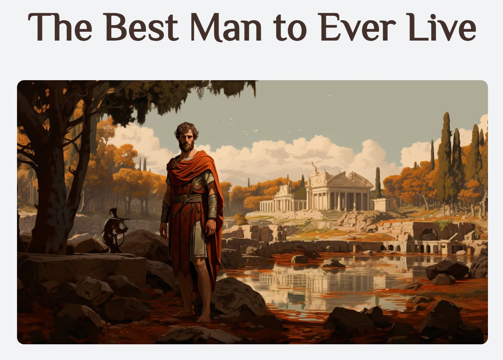

# recipes

The website will consist of a main index page which will have links to a few recipes. The goal is to practice HTML and later come back to implement some CSS.

This very first Odin project was fun to build. It took days, and they were days well spent. I came back and added styling. Then, I came back and changed the content from food recipes to lesson about stoicism. Then, I came back and implemented best practices that I had picked up.

Now, I come back to this project again. Despite being a static website, it offers a good opportunity to practice React Router. Here I am yet again.

## About the Project

### Preview

    

### Links

-[Assignment Page (Dec '23)](https://www.theodinproject.com/lessons/foundations-recipes)

-[Finished Project](https://erreurdesyntaxe.github.io/recipes/)

### Notable Features

-I rewrote this README long after the initial project and the incremental
updates, so this section is moot.

### Built With

  
  
  
   

### Challenges

-I rewrote this README long after the initial project and the incremental
updates, so this section is moot.

### Lessons

-Commit early and often  
-Basic HTML  
-Basic CSS  
-Intermediate HTML  
-Intermediate CSS

### Diary

-At one point, I hadn't committed anything in a long while, and the website
stopped working. I panicked and struggled with Git to revert back to a working
version, but in the end, I had to manually undo the changes. Lesson learned?

-I completed the Foundations course of The Odin Project today. I am very pleased
with the progress of the past month. Tomorrow, I plan on reading other
solutions' source code to see how others have achieve similar results and how
others accomplished much better with less.

The idea of looking back on my progress made me think of this project, aka the
first project. I had found a friend's work and was amazed by it. Now, my
design skills are still pretty bad, and I'll do something about that, but my
coding skills and knowledge have improved a lot, so I want to take another
shot at making a "recipe" website.

The new angle is the philosophy of stoicism. It is something that has become
meaningful, helpful, and dear to me. Building a website around stoicism will
help me understand the philosophy better.

I revisited this project many times to sharpen my skills and test my knowledge.
It has changed a lot since its first version.
